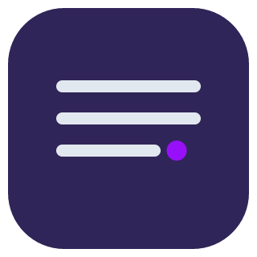

 

  

<h3 align="center">UiTMView</h3>

  

Fetch and generate timetable from iCRESS UiTM.
     
  

    <h1 align="center">Preview</h1>
    <a>
    
     
    
     
    
  </a>

### Built With

[![Next][Next.js]][Next-url] [![Tailwind CSS][Tailwind CSS]][Tailwind-url]

### LICENSE

### Disclaimer
This project is an independent initiative and has no official connection with Universiti Teknologi Mara (UiTM) or its affiliates. For more information, please visit [https://www.uitm.edu.my](https://www.uitm.edu.my).

[Next.js]: https://img.shields.io/badge/next.js-000000?style=for-the-badge&logo=nextdotjs&logoColor=white
[Next-url]: https://nextjs.org/

[Tailwind CSS]: https://img.shields.io/badge/TailwindCSS-38B2AC?style=for-the-badge&logo=tailwind-css&logoColor=white
[Tailwind-url]: https://tailwindcss.com/

[Spring-Boot]: https://img.shields.io/badge/Spring%20Boot-6DB33F?style=for-the-badge&logo=springboot&logoColor=white
[Spring-url]: https://spring.io/projects/spring-boot

[Supabase]: https://img.shields.io/badge/Supabase-3ECF8E?style=for-the-badge&logo=supabase&logoColor=white
[Supabase-url]: https://supabase.com/

[Docker]: https://img.shields.io/badge/Docker-2496ED?style=for-the-badge&logo=docker&logoColor=white
[Docker-url]: https://www.docker.com/